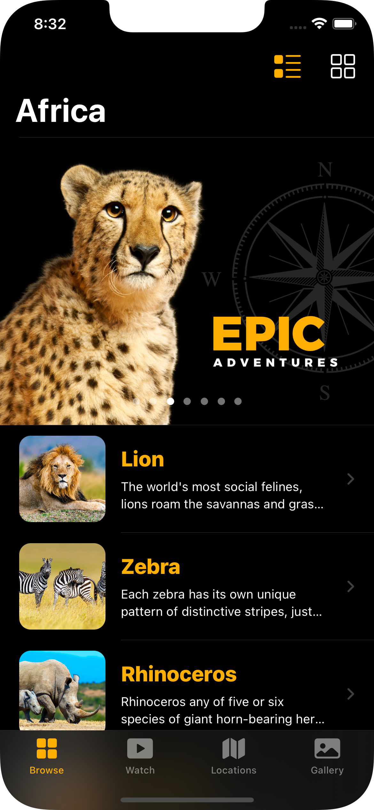
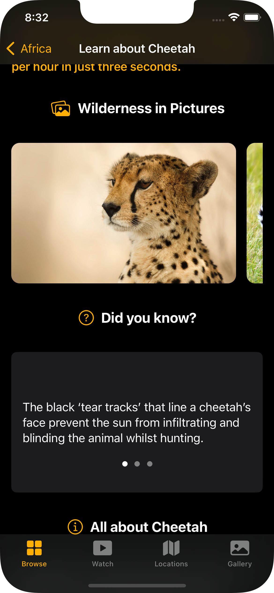
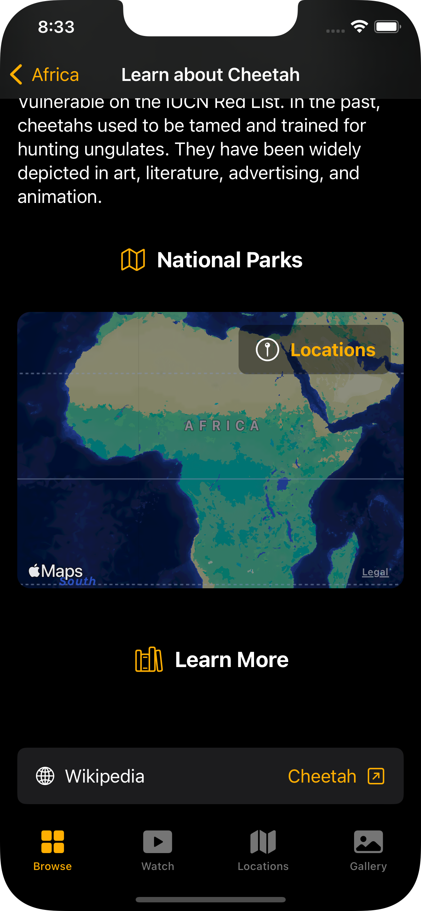
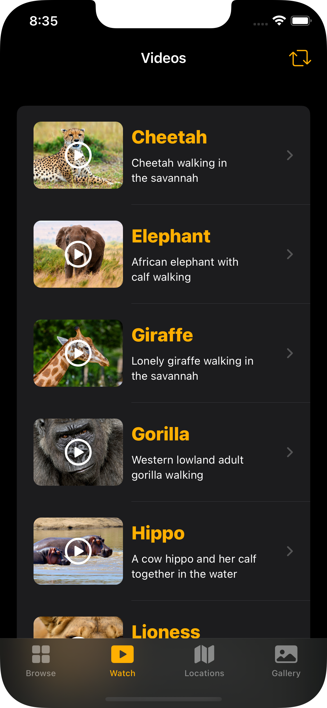
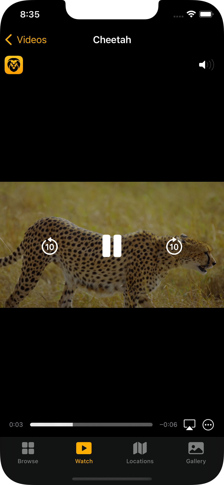
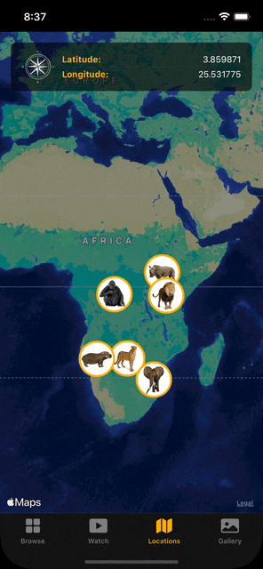
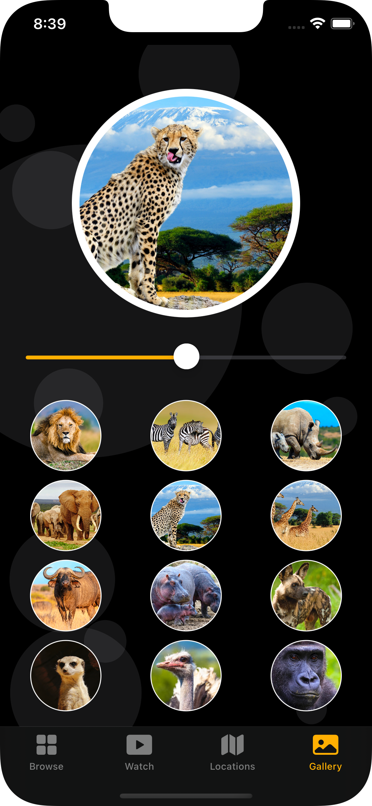
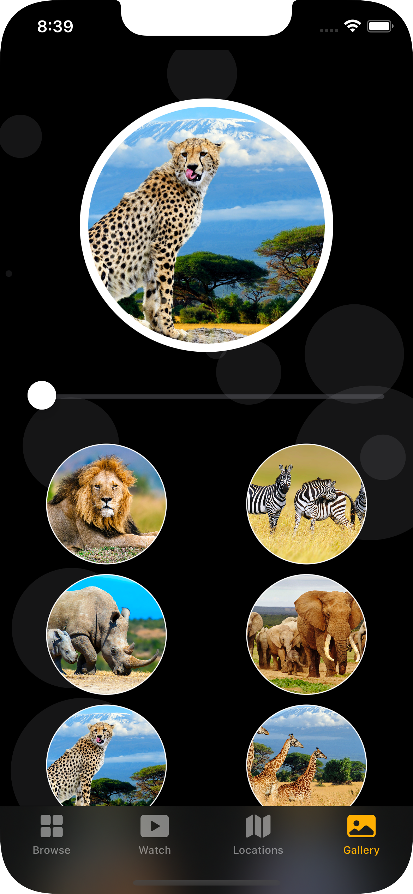

#  iOS, iPad OS and Mac app with rich features

## Features:
- iOS 14, SwiftUI
- Mac Catalyst version
- Dedicated sticker pack
- Local data (json)
- Advanced grid system
- Sliders and Tab views
- Video player
- MapKit with custom annotations
- Programmatic motion animation

## Screens:

### Home Screen

  
  
  

  
  
  

### Video Screen

  
  

### Map Screen
  

### Gallery
  
  
  
