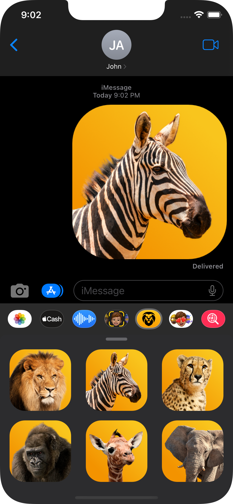
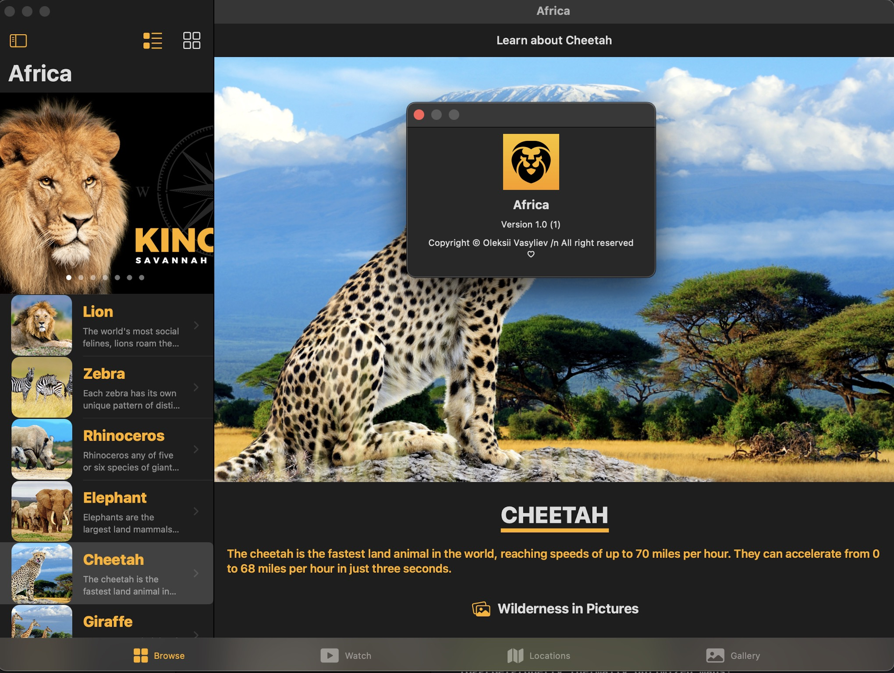

#  iOS, iPad OS and Mac app

## Features:
- iOS 14, SwiftUI
- Mac Catalyst version
- Dedicated sticker pack
- Local data (json)
- Advanced grid system
- Sliders and Tab views
- Video player
- MapKit with custom annotations
- Programmatic motion animation

## Screens:

Home Screen

 

Video Screen

  

Map Screen

Gallery

 

Stickers

Mac Catalyst

